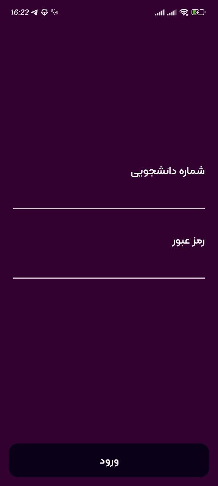
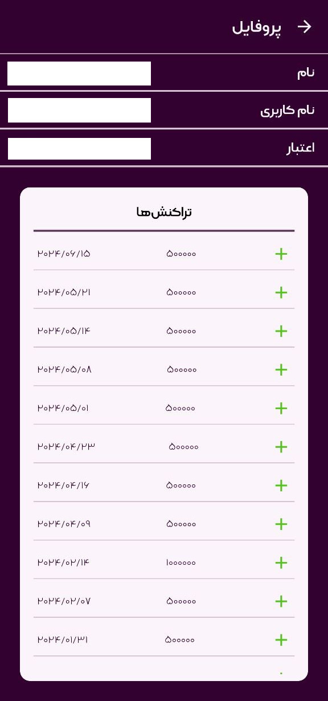

# Foodie: SUT Food Reservation Client

This is a client for SUT (sharif university of technology) food reservation system. **This project don't use any external server. Everything is handled by your phone and Samad servers.**

## 🖥️ Project Description

### Features

This project is still under development so there will be more about this part in the future. (hope so🤞)

#### Login

After your first login your username, password and token is saved in your phone so that you won't see the login page as long as the app can see the servers through your username, password.

#### Reservation

You can reserve your next week food by just pressing any of the desirable foods. Note that based on your university policy probably you can't reserve two foods in the same time, you must cancel one before reserving the other one. You can select different places for food reservation.

#### Reservation Information

You can see all your reservations in a card list view, it doesn't matter in what place you reserved your food, you can see it here.

#### Profile

There is a bit of your information in samad app. I repeat **there is no middle in server in connection of your phone to the server**, so you shouldn't be concerned about the information that my app provides.

### FrameWorks

The project architecture is MVVM, this is the main approach approved by GOOGLE. This project also uses the following frameworks:

- Jetpack Compose - for the main UI framework, so the viewModels are also affected by this fact.
- Retrofit2 - for connection to the server and api calls.
- Koin - for dependency injection. I could use dagger-hilt too but I thought it doesn't matter much at this point so I used my own preference.
- Room - for managing a database in your phone.

## 👨🏻‍💻 About Me

My name is `Amir Hossein Ravan Nakhjavani`. If you have any comments regarding the project -from design to the bottom level implementation- feel free to send me an email, so we could discuss about it.
